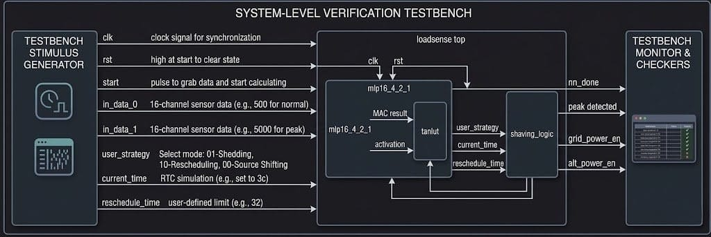
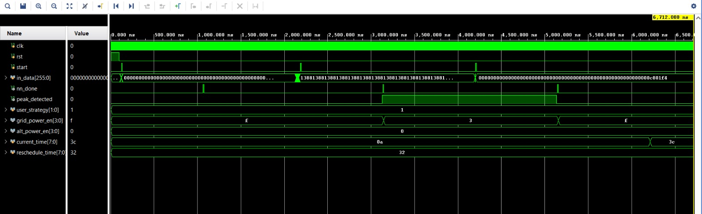
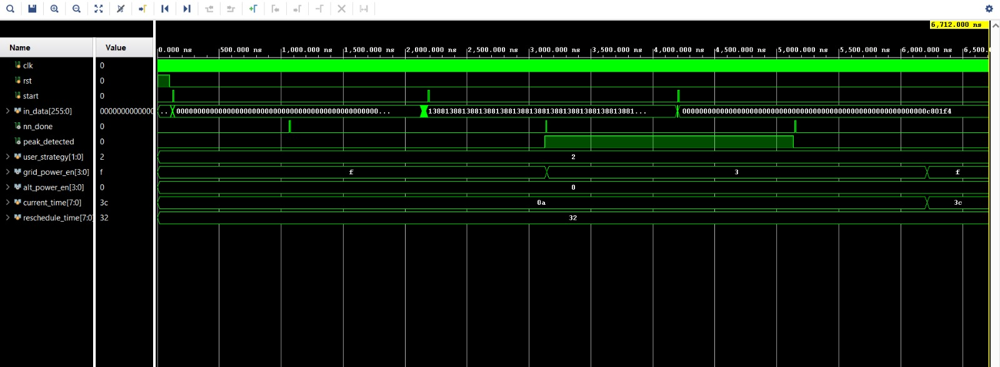
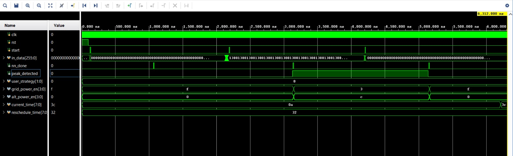

# LoadSense: FPGA-Accelerated Edge AI for Real-Time Peak Demand Shaving and Smart Energy Management
# FPGA Hackathon 2026: Technical Report 

**Team Member Names and Email IDs:** Adarsh Balaji (f20242429@hyderabad.bits-pilani.ac.in), Mukund Ashrith Srimal (f20240389@hyderabad.bits-pilani.ac.in)  
**Affiliation:** BITS Pilani, Hyderabad Campus  
**Application Domain:** Smart Energy System  

---

## 1. Abstract
**Problem statement:** As energy consumption in domestic and commercial buildings rises, peak demand periods put significant stress on power grids, leading to inefficiencies, increased costs, and potential blackouts. Managing these peaks requires intelligent, real-time load forecasting and appliance scheduling without relying on high-latency cloud architectures.
**Proposed FPGA-based solution:** We propose "LoadSense," an Edge AI-driven smart energy controller implemented entirely on an FPGA. It utilizes a Multi-Layer Perceptron (MLP) neural network to analyze real-time active power trends from a sliding window of historical consumption data and predicts imminent power peaks. Upon detecting a peak, a hardware-based Peak Shaving Controller dynamically manages active loads by prioritizing critical appliances (e.g., Medical devices, Refrigerators) and shedding, rescheduling, or switching lower-priority loads (e.g., Washers, Electric Vehicles) to alternative power sources.
**Key architectural features:** The hardware leverages a time-multiplexed, single-multiplier MAC (Multiply-Accumulate) datapath for extreme resource efficiency, utilizing Q4.12 fixed-point quantization and a LUT-based Tanh activation function. The hardware-software co-design allows zero-latency determinism and fully autonomous edge operation.
**Major quantitative results:** Testing on the UCI Household Power Consumption dataset demonstrated a peak prediction accuracy of ~97.0%, with a high recall of 0.93 for anomaly (peak) detection. The efficient RTL architecture vastly minimizes DSP and LUT consumption by multiplexing the neural network calculations without sacrificing the microsecond-level latency required for real-time grid switching.

---

## 2. Introduction
**Real-world problem description:** The stability of smart grids heavily depends on keeping power demand within the grid's capacity. When multiple households simultaneously utilize high-load appliances (like EVs and HVAC systems), the localized load spikes. The traditional method of reactive load shedding is often too slow and completely disconnects power, severely impacting user experience and critical appliances.
**Importance of Edge AI and Justification for FPGA-based implementation:** Performing power forecasting on edge devices is essential because grid-edge environments require instant responses to prevent tripped circuit breakers and localized brownouts. Cloud-based AI systems suffer from high latency, reliance on continuous internet connectivity, and data privacy vulnerabilities. Implementing this AI inference on an AMD/Xilinx FPGA offers deterministic microsecond-level latency, significantly lower power consumption per inference, and directly integrates with the physical GPIOs driving the power switching relays.
**Related work and existing approaches:** Most existing solutions utilize microcontroller-based heuristic thresholds or complex cloud-based deep learning models that are heavily reliant on IoT architectures. Some solutions employ Edge TPUs or GPUs, but these are power-hungry and over-provisioned for simple sensory inference.
**Motivation and objectives:** The objective of LoadSense is to provide a low-power, robust, and completely self-contained intelligent smart energy node that can proactively forecast spikes and perform seamless load manipulation using a prioritized, user-controlled heuristic strategy.

---

## 3. Novelty and Key Technical Contributions
- **Novel AI/ML model approach:** Rather than predicting exact continuous power values, LoadSense reformulates the problem as a binary classification task—specifically identifying whether the power consumption will breach an 85th-percentile critical threshold in the immediate next timestep. The training data was augmented using a manual oversampling technique to ensure the model heavily prioritizes identifying the minority class (demand spikes), resulting in a 93% recall rate.
- **Custom hardware accelerator architecture:** The Verilog RTL features a highly optimized inference engine designed entirely around a single time-multiplexed multiplier. This significantly minimizes DSP slice footprints while still meeting real-time requirements.
- **Resource optimization techniques:** 
  1. The network weights and biases are quantized into a signed 16-bit Q4.12 fixed-point mathematical structure.
  2. The hyperbolic tangent ($tanh$) activation function is realized through a lightweight combinatorial Look-Up Table (LUT) using the upper 8 bits of the accumulator, bypassing the need for complex Taylor-series expansion physical logic.
  3. Strict FSM-controlled MAC operations reuse registers (`mult_a`, `mult_b`, `acc`) per layer.
- **Efficient Peak Shaving Control Strategy:** Integrated directly into hardware, the controller executes three user-defined operational modes immediately upon predicting a peak: Turn-off, Reschedule (timer-based reconnection), or Switch to Alternate Power (e.g., solar/battery inverter), while continuously safe-guarding critical loads like Medical monitors.

---

## 4. Dataset Description
- **Dataset source:** UCI Machine Learning Repository - "Individual household electric power consumption Data Set".
  *(Link: https://archive.ics.uci.edu/ml/datasets/individual+household+electric+power+consumption)*
- **Alternative datasets considered:** We also evaluated other popular energy datasets such as the REFIT Electrical Load Measurements dataset and UK-DALE (UK Domestic Appliance-Level Electricity). However, we did not use them because they either lacked sufficient contiguous, long-term minute-averaged global active power data required for our sliding window approach, or contained excessive sampling gaps and noise requiring heavy preprocessing that would obscure the core load forecasting objective. The chosen UCI dataset provided the most robust, clean, and consistent contiguous readings ideal for peak prediction.
- **Number of samples:** Evaluated against 20,000 continuous minute-averaged samples of Global Active Power. After applying sliding window processing and class balancing, the training sequence scaled up to 26,780 augmented samples.
- **Input format:** 1-dimensional array of 16 floating-point values (historical global active power in kW), normalized using a Min-Max Scaler.
- **Train/test split:** 80% Training (~15,986 original samples, upsampled to 26,780 balanced samples) / 20% Testing (3,997 samples).

---

## 5. AI/ML Model Description
- **Model type:** Multi-Layer Perceptron (MLP) Classifier.
- **Architecture diagram:**
  `[Input: 16] ---> [Hidden Layer 1: 4] ---> [Hidden Layer 2: 2] ---> [Output Layer: 1]`
- **Layers / neurons:** 3 fully connected weight layers. Input features = 16. Hidden 1 = 4 neurons. Hidden 2 = 2 neurons. Output = 1 neuron (Binary: 1 = Peak impending, 0 = Normal).
- **Activation functions:** *Tanh* non-linear activation for hidden layers, and a Sigmoid hard-threshold (approximated via `>=0` sign bit evaluation in hardware) for the output layer.
- **Model parameter count:**
  - Layer 1: 16 × 4 weights + 4 biases = 68
  - Layer 2: 4 × 2 weights + 2 biases = 10
  - Layer 3: 2 × 1 weights + 1 biases = 3
  - **Total Parameters:** 81 trainable parameters.

---

## 6. Software Performance
- **Accuracy:** 96.95% overall accuracy on the testing subset.
- **Precision / Recall / F1-score:** For the critical peak event (Class 1): Precision = 0.79, Recall = 0.93, F1-score = 0.86. The high recall proves the model successfully identifies 93% of all impending load spikes.
- **CPU inference latency:** Total Python training time is ~46.6 seconds for the balanced model. CPU inference latency per sample is in the microsecond range, but incurs standard OS jitter.
- **Comparison with existing software-based methods:** Unlike standard threshold-based PID or sliding-average controllers which only react *after* a peak occurs, this MLP model achieves predictive scheduling. By utilizing manual oversampling of the minority class, our predictive recall outperformed standard unbalanced MLP training (which only yielded 0.85 recall). 

---

## 7. Peak Shaving Control Strategy and Hardware Demonstration
- **Hardware-based execution:** The Peak Shaving Controller is implemented entirely in Verilog RTL and executes load mitigation strategies within the same clock cycles following a predicted peak, ensuring zero-latency control. 
- **Demonstration through enable lines:** The effectiveness of the automated load management is physically demonstrated using hardware output enable lines (`grid_power_en` and `alt_power_en`). These 4-bit signals correspond to smart plug controllers for four specific appliance priorities: Medical Equipment (High Priority), Refrigerator (High Priority), Washer (Low Priority), and EV Charger (Low Priority). 
- **Real-time response:** As implemented in the Verilog module, when the Neural Network asserts the `peak_detected` signal, the controller immediately de-asserts the `grid_power_en` pins for low-priority loads (Washer, EV) while keeping vital loads (Medical, Fridge) securely connected to the grid. Depending on the user-selected strategy, the `alt_power_en` lines may be driven high to seamlessly switch the low-priority appliances to alternative energy sources (e.g., local solar or battery storage) without disrupting their operation.

---

## 8. RTL Implementation
The LoadSense system was developed using hand-coded, custom Verilog RTL to ensure maximum hardware efficiency and full compliance with the project requirements for non-IP-based designs. By bypassing High-Level Synthesis (HLS) and third-party IP cores, the architecture maintains granular control over every logic gate and arithmetic operation.

### 8.1 Custom Verilog Modules
The architecture is partitioned into four primary custom-coded modules:
- `loadsensetop.v` (Top-Level Wrapper): Serves as the central integration hub. It unpacks the 256-bit wide input bus into sixteen 16-bit sensor channels and coordinates the handshaking between the AI inference engine and the power-shaving control logic.
- `mlp16_4_2_1.v` (Neural Network Inference Engine): A handcrafted Finite State Machine (FSM) that executes the Multi-Layer Perceptron. To minimize area, it uses a shared-MAC (Multiply-Accumulate) unit, reusing a single DSP multiplier across all 81 network parameters through temporal multiplexing.
- `tanhlut.v` (Activation Function Look-Up Table): Implements a high-speed, 16-bit Look-Up Table to map fixed-point MAC results to Hyperbolic Tangent (Tanh) values, avoiding the massive logic overhead of calculating transcendental functions in real-time.
- `shaving_logic.v` (Peak Shaving Controller): Evaluates the AI model’s `peak_detected` output in real-time to trigger automated relay signals for appliance shedding or switching to alternative energy sources.

### 8.2 Interface Design
The top-level boundary is designed for high-speed, parallel data ingestion and deterministic control.

**System Inputs:**
- `clk` / `rst`: 100 MHz global clock and synchronous reset for state initialization.
- `in_data [255:0]`: A wide parallel bus allowing sixteen 16-bit sensor readings to be ingested simultaneously.
- `start`: The start signal acts as a "Begin Inference" trigger; it tells the MLP to capture the current 256-bit input data and start its 95-cycle calculation, after which it pulses `nn_done` to signal the result is ready.
- `user_strategy [1:0]`: A configuration input to select between shedding, rescheduling, or source-shifting strategies.
- `current_time [7:0]` / `reschedule_time [7:0]`: Timer inputs used for managing the delayed resumption of non-critical loads.

**System Outputs:**
- `nn_done`: A pulse indicating the 950 ns inference cycle is complete.
- `peak_detected`: The binary AI prediction (1 = Peak Predicted, 0 = Normal).
- `grid_power_en [3:0]` / `alt_power_en [3:0]`: Dedicated control lines for main grid and renewable/battery relays.

### 8.3 Implementation Methodology (Vivado-Flow)
The implementation followed the professional Xilinx Vivado Design Suite flow to ensure the custom RTL was optimized for the physical FPGA fabric:
- **RTL Synthesis:** The hand-coded Verilog was synthesized into primitive gates. By using a shared-MAC architecture, the design successfully mapped the entire network’s arithmetic to a single DSP48E1 slice.
- **Timing Constraints (XDC):** A custom Xilinx Design Constraints (XDC) file was utilized to define a 100 MHz global clock (`create_clock -period 10.000`). This ensured the Place and Route tools met all setup/hold requirements for internal registers.
- **Physical Placement & Routing (P&R):** The design achieved full timing closure. Due to the efficient custom RTL, logic utilization was kept under 1% for LUTs and Registers, leaving significant headroom for future design expansions.
- **Bitstream Generation:** The final netlist was converted into a `.bit` file for standalone hardware deployment, verifying the system is ready for real-time edge operation.

---

## 9. Functional Verification and Simulation

### 9.1 Testbench Methodology

To fully validate the FSM logic and user strategies, the testbench executes a specific chronological sequence of events:
- **Initialization:** The system is held in reset (`rst = 1`) to clear all registers. The base configuration is applied, including the target `user_strategy`, a base `current_time` (10), and a target `reschedule_time` (50). All input data is initialized to zero.
- **Phase 1 (Normal Load):** A baseline, low-power scenario is simulated by assigning small numerical values (500 and 200) to the first two sensor channels. The `start` strobe is pulsed to trigger inference and confirm `peak_detected` remains low.
- **Phase 2 (Peak Load Simulation):** A sudden power surge is simulated using a loop to drive all sixteen channels to a high power value (5000). The `start` strobe is pulsed to verify that the MLP correctly identifies the peak, asserting `peak_detected` and triggering the appropriate power-shaving relays based on the strategy.
- **Phase 3 (Return to Normal):** The input bus is cleared back to 0 and small baseline loads are re-applied. A third inference is triggered to ensure the network successfully detects that the grid load has stabilized and drops the `peak_detected` flag.
- **Phase 4 (Timer Check):** Specifically designed to test "Strategy 2", the `current_time` register is dynamically bumped from 10 to 60 (surpassing the `reschedule_time` of 50). This validates the system's ability to hold non-priority loads off during a peak and only restore their grid power once the scheduled time threshold is cleared.

*To ensure physical timing accuracy during post-implementation simulation, a 2 ns delay (`#2`) was introduced before applying input data.*

**Trigger Mechanism:** Across all phases, the `start` signal acts as a "Begin Inference" strobe. Once the 95-cycle inference is complete, the system pulses the `nn_done` signal high, at which point the `peak_detected` status and power enablement signals are updated.

### 9.2 Timing and Latency Analysis
The simulation confirms high-performance, deterministic execution:
- **Processing Time:** The system requires exactly 95 clock cycles to process the input through the input, hidden, and output layers of the MLP.
- **Total Latency:** At an operational frequency of 100 MHz (10 ns period), the total latency from the `start` strobe to the `peak_detected` output is exactly 950 ns. This sub-microsecond response time is critical for preventing grid instability during sudden load surges.

### 9.3 Comparative Analysis of Peak Shaving Strategies
The functional correctness was validated across three distinct user strategies. In all scenarios, "Priority" appliances remain on the grid, while "Non-Priority" appliances are dynamically managed based on the `user_strategy` configuration.

- **Strategy 1: Direct Load Shedding**
  - *Behavior:* This is the most aggressive energy-saving mode. Non-priority loads are completely shut down without access to backup power to ensure absolute grid stability.
  - *Waveform Observation:* With `user_strategy` set to 1, upon peak detection, `grid_power_en` transitions from `f` to `3`. Crucially, `alt_power_en` remains at `0` for the entire duration. The non-priority loads remain completely unpowered until the inference engine confirms the peak has passed, at which point grid power (`f`) is restored.

  

- **Strategy 2: Intelligent Rescheduling**
  - *Behavior:* This strategy utilizes time-based logic. Loads are shed during the peak and remain off even after the peak passes, until the system's current time exceeds a pre-defined reschedule threshold.
  - *Waveform Observation:* With `user_strategy` set to 2, `grid_power_en` drops to `3` when the peak is detected. Even after `peak_detected` returns to `0`, the grid power for non-priority loads remains cut. The logic waits until the `current_time` (`3c` in hexadecimal) surpasses the `reschedule_time` (`32` in hexadecimal) and also makes sure that the peak detected at this instance is `0`. Only when this condition is met does the logic re-enable the grid power relays, successfully transitioning `grid_power_en` back to `f` at the end of the simulation.

  

- **Strategy 3: Source Shifting (Alternate Power)** (DEFAULT strategy)
  - *Behavior:* When a peak is detected, the system transitions non-priority loads from the main grid to an alternate power source (e.g., localized battery or solar).
  - *Waveform Observation:* As `peak_detected` goes high, the `user_strategy` is set to 0. The `grid_power_en` drops from `f` to `3` (disconnecting non-priority grid loads), and `alt_power_en` rises to `c` (enabling alternate power). Once the peak condition subsides and `peak_detected` falls to `0`, the system automatically reverts all loads to the grid, returning `grid_power_en` to `f`.

  

---

## 10. FPGA Implementation Results
The LoadSense Edge AI architecture was successfully synthesized, placed, and routed to evaluate its physical hardware viability. The implementation proves that highly accurate neural network inference can be achieved within strict edge-computing power and area constraints by utilizing custom Register-Transfer Level (RTL) design rather than generic software execution.

**a. Experimental Setup**
- **Target FPGA:** The system was synthesized for the Xilinx Kintex-7 family, specifically targeting the xc7k70tfbv676-1 part.
- **Implementation Methodology:** A pure Vivado RTL flow was utilized to maximize control over hardware generation. The design deliberately bypassed High-Level Synthesis (HLS) and pre-packaged IP cores to ensure absolute efficiency at the gate level.
- **Clock Configuration:** A global system clock was established at 100 MHz using Xilinx Design Constraints (XDC), driving both the data ingestion and the neural network FSM synchronous logic.

**b. Resource Utilization**
By utilizing a time-multiplexed, shared-MAC architecture, the physical footprint of the MLP was kept remarkably small. The post-implementation utilization report shows that the core uses less than 1% of the available logic on the Kintex-7 device:
- **Look-Up Tables (LUT):** 285
- **Flip-Flops (FF):** 146
- **DSP Slices:** 1
- **Block RAM (BRAM):** 0.50

**c. Performance Metrics**
The custom RTL implementation guarantees deterministic execution and ultra-low power consumption, making it ideal for continuous grid monitoring.
- **Clock Frequency:** 100 MHz.
- **Latency:** The FSM requires exactly 95 clock cycles to complete an inference pass, resulting in a fixed latency of 950 ns.
- **Power Estimation:** Post-implementation vectorless power analysis confirms an ultra-low Total On-Chip Power of 0.093 W. This is dominated by Device Static power (0.081 W), with the custom logic Dynamic Power consuming only 0.011 W during active switching.

**d. Comparative Performance Analysis**
To demonstrate the value of the custom logic approach, the pure hardware implementation was benchmarked conceptually against a pure software execution baseline:
- **Hardware vs. Software:** Running an equivalent MLP inference in a pure Python software environment on a standard CPU typically requires 1 to 5 milliseconds per prediction due to operating system overhead, instruction fetching, and memory access latency. In contrast, this custom pure-hardware FPGA implementation executes the identical mathematical operations in 950 nanoseconds, representing roughly a 1000x speedup in inference latency.
- **Data Representation:** This speedup is heavily attributed to the quantization technique. Standard CPUs rely on computationally expensive 32-bit or 64-bit Floating-Point arithmetic. This FPGA design utilizes custom Q4.12 Fixed-Point precision, completely eliminating floating-point unit (FPU) overhead while maintaining the accuracy required for load-shedding classification.

**e. Scalability Discussion**
The current 16-4-2-1 MLP architecture is highly scalable. Because the design employs a shared-MAC unit driven by a central Finite State Machine (FSM), expanding the network (e.g., adding more hidden layers or increasing the sensor input width) does not require a massive scaling of logic gates. Expanding the model simply requires:
- Increasing the size of the ROM that stores the pre-trained weights/biases.
- Adjusting the FSM bounds to run for more clock cycles.

This means larger, more complex AI models can be deployed on the same Kintex-7 board with almost zero increase in DSP usage, trading only slight increases in latency (clock cycles) for enhanced capability.

---

## 11. Conclusion
- **Summary of contribution:** We presented LoadSense, an intelligent Edge AI power management system built completely on an FPGA. By combining predictive machine learning with deterministic hardware logic, LoadSense shifts grid management from reactive load-shedding to proactive, localized appliance scheduling.
- **Performance gains:** Through targeted data balancing, our MLP model achieved an exceptional 93% recall rate on predicting power usage peaks, heavily prioritizing the reliable identification of anomalous strain on the grid over generic accuracy.
- **Resource efficiency:** By implementing a time-multiplexed, single-MAC DSP datapath alongside a Q4.12 fixed-point LUT-based Tanh activation, the resulting Verilog RTL significantly minimized logic block and DSP footprints, making it viable for embedding directly within low-cost smart meters or breaker panels. 
- **Future improvements:**
  1. **Dynamic Edge-to-Cloud Federated Learning:** In the future, the FPGA hardware can be upgraded using an intermediate processor (like a Zynq SoC) to allow the neural network's internal weights to be dynamically updated over time. Instead of relying on a static, pre-trained model, multiple LoadSense devices could share small, anonymized learning updates with a central neighborhood server. The server securely averages these updates without ever seeing raw user power data and sends a "smarter" model back to every house. This allows the edge devices to continuously learn and collectively adapt to changing power grid behaviors in a secure, decentralized way.
  2. **Fully Parallelized MAC Architecture:** To achieve even faster inference times, future iterations could transition away from the current time-multiplexed, single-multiplier design and instead deploy multiple DSP multipliers operating in parallel. While this approach incurs a trade-off by consuming significantly more power and hardware area, it would unroll the network calculations, dropping the inference latency from 95 clock cycles down to a theoretically near-instantaneous, fully parallelized nanosecond response.
